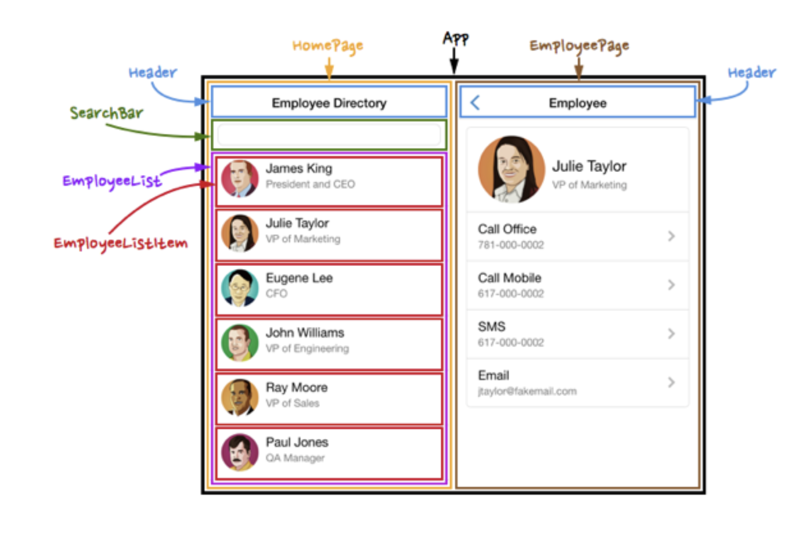

# CardFlasher
Online Flash card generator for studying. 

## Description 

This application lets a user create an online profile and login where they can create flashcard decks for studying. They can add as many cards as they want and write whatever they want on the fronts and backs of the cards, and they can also make multiple decks with different deck names. The application also has a feature where the user can click on a "shuffle" button to randomize the order of the cards in a deck for better studying. They can click "shuffle" as many times as they want to keep re-randomizing the order of the cards. The different flashcard decks will be saved to the user's profile so that the user can logout and then log back in at any time to see their decks again or study again.

## Table of Contents: 

1. Title  
2. Description  
3. Table of Contents  
4. Technologies Used  
5. User Story  
6. Acceptance Criteria  
7. Installation  
8. Usage  
9. Wireframe  
10. Contributors/Author Info  
11. License  
12. Deployed Link   

## Technologies Used

|        |  | 
| ------------- |:-------------:| 
| HTML                |  | 
| CSS                 |  | 
| Markdown            |  |
| VS Code             |  |   
| Git                 |  |  
| Github              |  |
| CreateReact         |  |
| React Router        |  |
| React.js            |  |
| Node.js             |  |
| Express.js          |  |
| Axious or Fetch API |  |
| JSON                |  |
| Render              |  |
|________________________|

## User Story 

AS A USER, 
 
 
I WANT a website where I can customize my own flashcards in my own profile
 
 
SO THAT I can log out and log back into my profile whenever I want and use my custom flashcard decks to study for various topics. 
 

## Acceptance Criteria

1. **Login/CreateProfile**

   - **Given**: A user lands on the Login page,
   - **Then**: the user can then either log in or click on 'create profile.'

2. **Create Deck Page**

   - **Given**: A user navigates to the "Create Deck" page,
   - **When**: the user inputs their deck's name and what they'd like to write on the front and back of each card, as many cards as they want in their deck,
   - **Then**: they should be able to save it to their profile, shuffle it, and use it to study. 

## Installation 

N/A

## Usage 

To use this website, click on the deployed link at the bottom of this ReadMe file. Then you can create your profile, then log into your profile. Once you have logged into your profile, you can navigate to the home page, about page, or contact page. You can also go to the 'create deck" page to create your first flashcard deck: Give the deck a title and write what you want on the front and back of your first card. Then add more cards. Then click the submit button to save your deck and start using it to study.

## Wireframe

## Contributors/Author Info

* Heather Serrano (magneticsoul7) https://github.com/MagneticSoul7   
* Alexander Davis (Redwolf917) https://github.com/Redwolf917   
* Michael Isaac Isom (Michael-Isom) https://github.com/Michael-Isom   

## License

MIT License.

## Deployed Link

